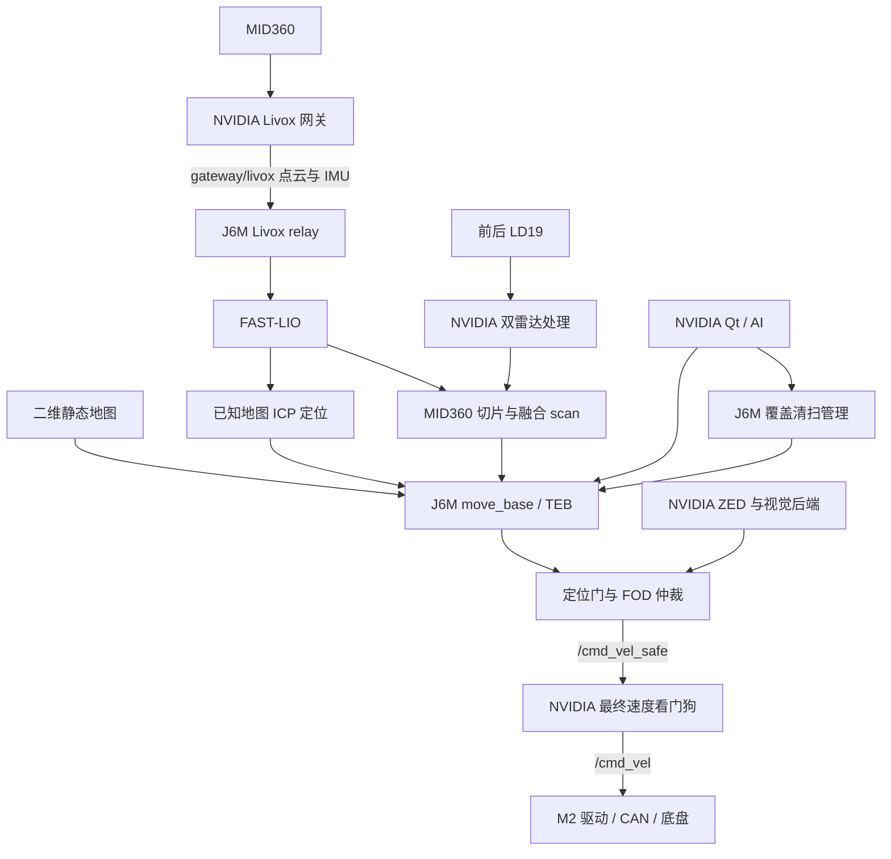

# autolabor-robot-nav：双机地面机器人导航工程

本文根据 `../autolabor-robot-nav` 的源码、配置模板、启动脚本及现有架构文档整理，阅读日期为 2026-10-02。工程面向 Autolabor/M2 地面机器人，采用 ROS1 Noetic，由 NVIDIA 主机处理硬件、相机、界面和最终速度输出，J6M 负责定位、导航、覆盖清扫和安全仲裁。

本副本对应原工程的 **2026-09-07 导航优化候选版**，原部署目录为 `/home/slam/robot_j6m_ws_navigation_20260907`，独立 J6M 运行根为 `/map/robot_j6m_navigation_20260907`。原 README 保留了大量早期部署记录；历史时间点的运动门、版本和在线状态不能当作本副本的实时状态。

## 1. 本地副本状态

当前目录是源码副本，尚不具备直接启动完整项目的条件：

- `scripts/optimized.sh` 明确校验原部署绝对路径。在 `/home/d/robotproject/autolabor-robot-nav` 执行时会返回 `Unexpected candidate directory; audit paths before relocating this version.`。
- 本副本只有 `config/dual_host.env.example`，没有实际的 `config/dual_host.env`。
- 没有 `build/`、`devel/`、`runtime/` 或 `global_maps/map_sets/`；原文档中的地图、运动授权标记、ASR checkpoint 等运行数据不在当前目录中。
- 部分依赖指向外部 `/home/slam/robot_ws/.deps`、Python 环境、检测/分类模型和其他模型目录；配置模板不是当前机器已经安装这些资产的证据。

迁移时需要审查隔离脚本、固定路径、设备身份、依赖架构、地图和模型资产，并配置实际环境。`load_config.sh`、`setup_env.sh` 同样要求隔离入口，不能仅绕过入口校验就视为迁移完成。

## 2. 主要功能

- MID360 激光惯性里程计与三维点云建图。
- 三维已知地图 ICP 定位、二维静态地图导航和融合雷达避障。
- move_base/TEB 点到点导航。
- 多边形区域与批次覆盖清扫，包含扫描线规划、Hybrid A* 转场和任务暂停/恢复。
- ZED RGB-D 垃圾检测/分类、FOD 视觉任务与速度仲裁。
- Qt 操作台与嵌入式 RViz，包括地图、清扫、视觉和诊断页面。
- 可选 J6M BPU FCOS RGB-D 与 CenterPoint 候选感知。
- 可选本地 Whisper ASR、AI 计划和 MCP 工具，沿用现有导航执行链。

工程保留了 `gps_module` 和其他导航代码；当前候选版文档描述的是室内双机方案，不能直接套用早期机场 GPS 运行流程。

## 3. 双机职责与网络

| 功能 | NVIDIA 主机 | J6M |
| --- | --- | --- |
| ROS master | 接入同一 ROS 图 | 运行 master |
| MID360 物理驱动、前后 LD19 驱动 | 运行 | 接收 ROS 数据 |
| FAST-LIO 与已知地图定位 | 显示结果 | 运行 |
| MID360/LD19 避障融合 | 提供前后雷达数据 | 生成导航 `/scan` |
| map_server、move_base、TEB、覆盖管理 | 操作界面 | 运行 |
| USB-CAN/M2 与最终速度看门狗 | 运行 | 提供经仲裁的指令 |
| ZED SDK、视觉后端、Qt/RViz | 运行 | 接收精简检测结果 |
| BPU 感知 | RGB-D 桥与显示 | BPU 模型服务、点云候选链 |
| AI/MCP、本地 ASR | 运行 | 复用导航和覆盖服务 |

原现场网络：

```text
MID360 192.168.1.112 ←→ NVIDIA 专用网卡 192.168.1.50
J6M    192.168.10.100 ←→ 交换机 ←→ NVIDIA 192.168.10.50
NVIDIA Wi-Fi：互联网与默认路由

ROS_MASTER_URI=http://192.168.10.100:11311
ROS_IP：各主机自己的 192.168.10.x 地址
```

两条有线链路使用不同子网；ROS 节点通信还需要双向动态 TCP 端口可达。不要设置 `ROS_HOSTNAME`。USB 网卡由永久 MAC 或唯一匹配的 USB VID:PID 加序列号识别，不能把变化的 `ethN` 当作设备身份。模板与历史架构资料中存在不同的 MAC 记录，迁移时应以真实设备和实际配置核对。

## 4. 目录结构

```text
autolabor-robot-nav/
├── config/                       双机配置模板、导航参数 profile
├── scripts/                      隔离、启停、构建、部署、地图和诊断入口
├── deploy/j6m/                   chroot 挂载、发布、启停、健康检查、回滚
├── docs/                         架构、交接、实验及问题记录
├── global_maps/                  地图说明；本副本没有实际地图集
├── experiments/                  BPU 等独立实验
├── src/
│   ├── application/              覆盖清扫、FOD、BPU 感知、Qt、消息等
│   ├── autolabor_core/           CAN/M2 驱动
│   ├── localization_fastlio/     FAST-LIO 与已知地图定位
│   ├── navigation_arena/         move_base 相关代码、TEB fork
│   ├── perception_camera/        ZED ROS 包及接口
│   ├── perception_ldlidar/       LD19 驱动和双雷达处理
│   ├── perception_livox/         Livox SDK2 与驱动源码
│   ├── platform/                 双机平台包、launch 和网关配置
│   ├── scripts/                  robot_bringup ROS 包
│   ├── sweeper_mcp/              AI/MCP 与本地 ASR 接入
│   └── tools/                    诊断工具
├── ultralytics_yolo11_custom/     自定义视觉代码
├── README.md                     原操作说明与历史记录
└── AGENTS.md                     项目工作约束与历史交接
```

主要 ROS 包包括 `fast_lio`、`fast_lio_localization`、`autolabor_dual_host`、`autolabor_dual_lidar`、`conventional`、`teb_local_planner`、`autolabor_coverage`、`autolabor_fod_control`、`autolabor_fod_vision`、`autolabor_bpu_perception`、`autolabor_operator_gui`、`robot_bringup`、`sweeper_mcp` 和 `robot_diagnostics`。

## 5. 数据与控制链



FAST-LIO 定位输入保持为 MID360 点云与 IMU，LD19 用于独立避障链。静态地图模式下，ICP 节点建立 `map → camera_init`，FAST-LIO 继续提供局部里程计；`map_server` 只加载二维图，本模式不使用 AMCL。

导航速度通过定位门、FOD 仲裁和最终看门狗后才到达底盘。看门狗检查指令新鲜度、有限值、速度上限及节点所有权；定位、传感器或控制链条件失效时按现有逻辑停车。普通目标经过目标门，覆盖任务以自己的 action 管理分段执行。

### 覆盖清扫与 2026-09-07 优化

覆盖规划在静态地图中裁剪可清扫区域、生成弓字扫描线并排序。区域首线入场使用普通 Navfn/TEB；后续线间转场从实测位姿运行 Hybrid A*，在换向点拆为固定档位段，由 TEB 跟踪并在交接前确认停车。

候选版把正式 Hybrid A* 规划改为可取消 action：

- 入口：`/move_base/CoverageGlobalPlanner/plan_hybrid_transitions`。
- 窗口逐级扩展为 `6 × 6 m`、`10 × 10 m` 和全图，预算分别为 `0.75 s`、`1.25 s`、`3.00 s`，滚动/恢复总预算为 `5 s`。
- 每层两路搜索使用启发权重 `1.05` 和 `1.35`；首个可行结果后保留 `0.10 s` 比较窗口，优先减少换向，再比较预计执行时间。
- 任务取消或代次变化会撤销旧搜索，旧结果不能提交到新任务。后台搜索允许 move_base 回调继续处理状态和取消。

这些数字来自候选版代码及交付记录，表示规划配置，不构成当前实车运行性能保证。

## 6. 环境与构建部署

原部署基于 NVIDIA/Jetson ARM64、ROS Noetic、ZED SDK/CUDA，以及 J6M 上的 Ubuntu 20.04 ARM64 chroot。主要依赖包括 catkin、PCL、Eigen、OpenCV、Qt/RViz、TEB 相关库、Livox SDK2、SSH/rsync 和 bubblewrap。视觉、BPU 和 ASR 还需要各自模型、运行库和 Python 环境。

实际配置集中于 `config/dual_host.env`；[模板](config/dual_host.env.example) 提供网络、串口、确认标志、运动门、速度、地图和感知开关。模板中的 `NVIDIA_FOD_BACKEND=yolo`、`BPU_PERCEPTION_ENABLED=false` 与历史现场记录中的 `detect_and_classify`、BPU 开启状态不同，不能把历史状态写成当前默认配置。

**以下命令适用于原部署环境，当前副本需完成迁移审查后才可使用对应入口。**

NVIDIA 构建与静态检查：

```bash
cd /home/slam/robot_j6m_ws_navigation_20260907
./scripts/optimized.sh build
./scripts/optimized.sh check --static
```

构建入口执行 Release 模式 `catkin_make`，启用测试，默认 4 个编译任务；产物在本机 `build/`、`devel/`。相关测试可在隔离环境中执行：

```bash
./scripts/optimized.sh run bash -lc \
  'source scripts/setup_env.sh; catkin_make run_tests; catkin_test_results --all build/test_results'
```

J6M 使用独立发布链；停止主链后执行：

```bash
./scripts/optimized.sh deploy
ssh root@192.168.10.100 \
  /map/robot_j6m_navigation_20260907/dual_host/bin/health_check.sh
```

部署脚本选择性同步源码，在板端 ARM64 chroot 原生 `catkin_make install`，生成时间戳 release，检查后原子切换 `current`。本机 `devel/` 不会自动成为 J6M 的安装产物。当前脚本白名单包含覆盖与 BPU 感知等包；改变白名单之外的包时，普通部署不会自动发布该修改。

候选版发布目录位于 J6M 的：

```text
/map/robot_j6m_navigation_20260907/
├── rootfs/opt/autolabor/dual_host/
│   ├── releases/<时间戳>/install/
│   └── current -> 当前 install
├── dual_host/bin/                启停、健康检查、回滚
├── dual_host/config/             运行配置
├── maps/                        地图持久数据
└── logs/                        运行日志
```

先停止主链，再通过候选运行根的 `rollback.sh --list` 查看或切换历史版本。不要复制其他架构 ELF、直接改历史 release 或覆盖原版运行根。

## 7. 原部署环境的统一启停

候选版统一使用 `scripts/optimized.sh`，监督服务为 `autolabor-navigation-20260907.service`。它还检查原版和旧候选服务，避免多个版本同时占用 master 或底盘。

```bash
cd /home/slam/robot_j6m_ws_navigation_20260907

# 无图增量里程计/建图模式
./scripts/optimized.sh start

# 已停止时，显式加载完整地图集
./scripts/optimized.sh start --map-set global_maps/map_sets/latest

# 已运行时，完整冷重启；静态模式每次都要带地图参数
./scripts/optimized.sh restart --map-set global_maps/map_sets/latest

# 状态、严格数据流检查和完整停止
./scripts/optimized.sh status
./scripts/optimized.sh check --runtime
./scripts/optimized.sh stop
```

不带 `--map-set` 的 `start/restart` 进入无图模式，不会自动复用上次地图。需要加载纯 LD19 二维图时，附加 `--static-map-source lidar2d`；默认静态地图源为融合图。

启动依次检查网络与设备、同步 J6M 时间/配置/地图、启动两端 ROS 栈及伴随模块，并完成检查。看到 `Dual-host project is ready and managed by autolabor-navigation-20260907.service.` 才表示监督启动流程完成；窗口出现不等同于完整数据链通过。严格验收仍看 `check --runtime`。

静态模式冷启动后，操作员需在 Qt 地图 `READY` 后设置本次真实初始位姿，等待定位 `LOCALIZED`。系统不会自动复用历史初值或恢复旧目标。不要只重启 NVIDIA 网关或某个定位节点，故障恢复使用完整双机冷重启。

主运动门与 FOD 运动门相互独立。模板两门均为 `false`，CAN 和双雷达端口确认标志也为 `false`；主运动开启还需要候选工作区的 `runtime/motion_authorized.ok`。原候选版最新交付记录同样为零速、未复制运动授权状态。实际速度和运动能力应以现场配置及运行参数为准。

## 8. 地图、感知与 AI

完整静态地图集结构为：

```text
global_maps/map_sets/<session>/
├── manifest.yaml
├── map_3d/                      三维 PCD，供已知地图 ICP
├── map_2d/                      LD19 二维 PGM/YAML
├── map_fused_2d/                二维图与持久 MID360 高度切片融合
└── coverage_regions/            对应地图源下的已保存清扫区域
```

Qt 的静态建图流程生成上述三类地图，完整成功后才原子更新 `latest`。普通录包不会自动生成地图。离线静态建图要求 bag 包含 `/cloud_registered`、`/dual_lidar/scan` 和 `/Odometry`；对应入口是 `scripts/build_static_map_from_bag.sh`。

视觉后端支持 YOLO、LocateAnything 和两阶段 `detect_and_classify`。后者先检测 `trash`，再分类为 `metal`、`plastic`、`paper`、`glass`、`kitchen_waste`；运动候选还需满足同步深度等条件。后端切换通过受管理的完整重启完成。

BPU FCOS 与 CenterPoint 是独立可选链。参考 COCO/nuScenes 模型不能当作五材质垃圾模型；CenterPoint 的候选观察结果不能直接描述为已经接入正式避障控制。历史 RGB-only、RGB-D 和完整导航性能属于不同实验条件。

AI/MCP 复用地图导航、区域库、覆盖和 FOD 接口。语音采集、云端解析、AI 控制分别设门；本地 Whisper `large-v3` 还需要 CUDA、checkpoint、哈希校验和实际音频设备。完整程序启动不自动等同于这些能力已授权或可用。

## 9. 诊断与资料入口

| 检查对象 | 入口或证据 |
| --- | --- |
| 硬件设备归属 | `scripts/discover_devices.sh`、实际配置 |
| J6M/MID360 两条网络 | `scripts/network_check.sh` |
| ZED USB 3.x 与访问权限 | `scripts/zed_camera_check.sh`，同时确认 RGB/深度消息新鲜 |
| 主定位与静态定位 | `/Odometry`、`/fast_lio/localization_status` |
| 避障输入 | `/scan`、`/avoidance/dual_lidar_active` |
| 地图显示 | `/map`、`/autolabor_operator_gui/map_display_status` |
| 覆盖任务 | `/coverage/status` |
| 控制链 | `/cmd_vel_navigation`、`/cmd_vel_safe`、`/cmd_vel` 及底盘反馈 |
| 本机监督器 | `systemctl --user show autolabor-navigation-20260907.service -p ActiveState -p MainPID` |
| 本机日志 | `log/dual_host_launcher_*/`、`log/nvidia_ui_*/`、`log/ros/` |
| J6M 日志 | `/map/robot_j6m_navigation_20260907/logs/` |

本机服务最近日志：

```bash
journalctl _SYSTEMD_USER_UNIT=autolabor-navigation-20260907.service \
  -n 100 --no-pager
```

进一步阅读：

- [原 README：最新候选版操作入口及历史记录](README_HISTORY.md)
- [双机架构](docs/ARCHITECTURE.md)
- [2026-09-07 导航优化交付记录](NAVIGATION_OPTIMIZATION_20260907.md)
- [地图存储与静态建图](global_maps/README.md)
- [双感知接入记录](DUAL_PERCEPTION_20260906.md)
- [AI/MCP 说明](src/sweeper_mcp/README.md)

原优化记录报告了 Release 构建、195 项工作区测试与 10 项隔离生命周期测试通过，以及当时的 J6M release `20260907_141331`；这些是历史记录，不是本次重新验证的结果。本次仅阅读文件并生成文档，未构建、部署、连接 J6M、查询实时 `current` 或启动机器人。
